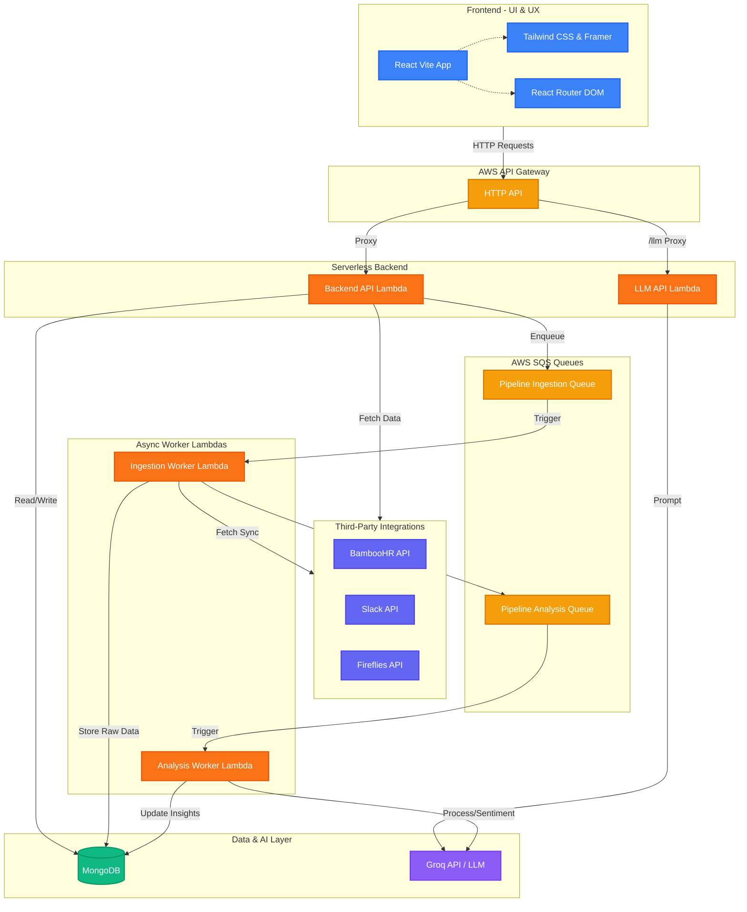

# SAHAY - HR Intelligence Platform

SAHAY is an advanced HR Intelligence Platform designed to provide proactive workforce management through AI-driven insights. It aggregates data from multiple sources (like BambooHR, Slack, and meeting transcripts via Fireflies) to generate real-time sentiment analysis, meeting summaries, and risk alerts for employees.

## 🚀 Features
- **Centralized Dashboard**: At-a-glance workforce overview, including total employees, recent meetings, and at-risk personnel.
- **AI-Powered Insights**: Uses Groq LLMs to analyze communication channels and transcripts for sentiment and health scoring.
- **Seamless Integrations**: 
  - **BambooHR**: Syncs employee registry and details.
  - **Slack**: Ingests team communication to assess mood and engagement.
  - **Fireflies**: Retrieves and summarizes meeting transcripts.
- **Background Processing**: Uses AWS SQS and Lambda to handle heavy data ingestion and LLM pipelines asynchronously without blocking the UI.
- **Actionable Alerts**: Automatically categorizes employee flight risk (Low, Medium, High, Critical) based on their sentiment and activity.

## 🏗️ System Architecture

The application is split into a modern React frontend and a scalable Serverless backend, utilizing event-driven microservices.



### Frontend
- **Framework**: React (built with Vite)
- **Styling**: Tailwind CSS, Lucide React (Icons), Framer Motion (Animations)
- **Routing**: React Router DOM

### Backend
- **Architecture**: Serverless Framework (AWS Lambda, API Gateway)
- **Database**: MongoDB
- **Asynchronous Tasks**: AWS SQS (for handling BambooHR syncs, Slack ingestion, and LLM processing queues)
- **AI/LLM**: Groq API

## 🛠️ Getting Started

### Prerequisites
- Node.js (v18+)
- AWS CLI (configured for Serverless deployment)
- MongoDB Cluster
- API Keys for Groq, Slack, BambooHR, Google (optional)

### Local Development

1. **Clone the repository**
   ```bash
   git clone https://github.com/parth-to-syntax/Sahay.git
   cd Sahay
   ```

2. **Frontend Setup**
   ```bash
   cd frontend
   npm install
   # Create a .env file based on .env.example
   npm run dev
   ```
   The frontend will run at `http://localhost:5173`.

3. **Backend Setup**
   ```bash
   # From the root directory
   npm install
   # Configure your .env file with MongoDB URI, AWS credentials, and API keys
   serverless offline start
   ```

## 📦 Deployment

The backend is configured to be deployed on AWS using the Serverless Framework.

```bash
serverless deploy
```

The frontend can be deployed on any static hosting provider like Vercel, Netlify, or AWS S3 + CloudFront.

## 📄 License
MIT License
